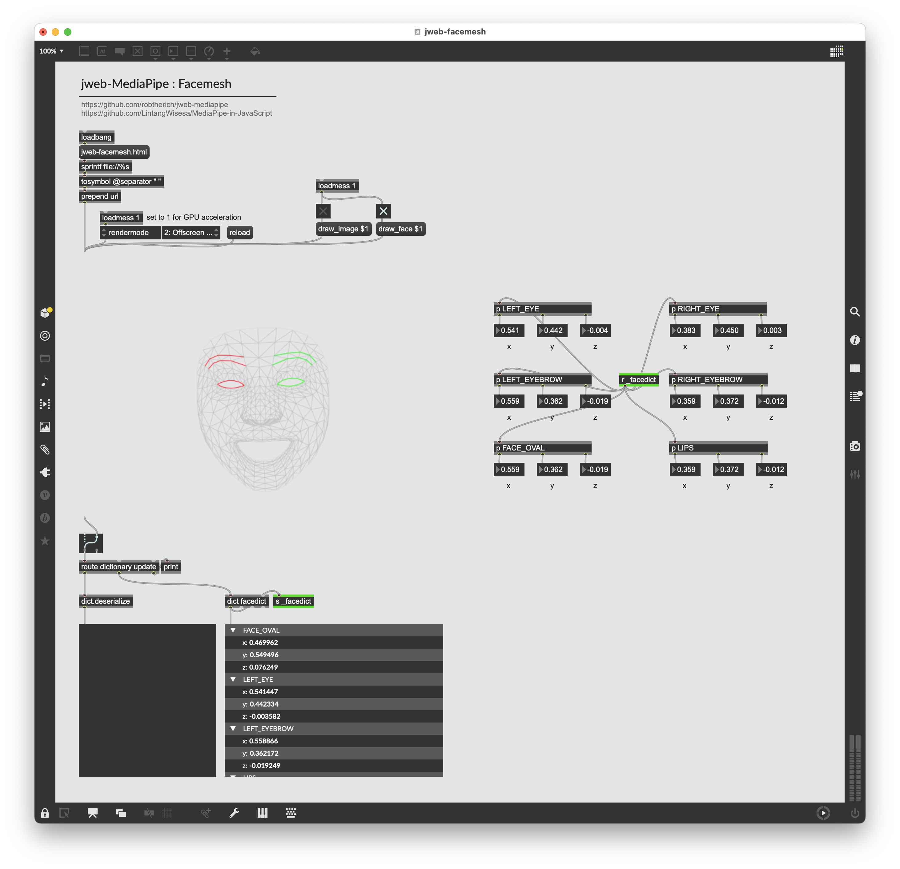

# jweb-facemesh

A self contained example demonstrating how to use Mediapipe Facemesh with Max's `jweb`

## Resources

This example is inspired by [an example by Rob Ramirez](https://github.com/robtherich/jweb-mediapipe), which is in turn inspired by [MediaPipe in JavaScript](https://github.com/LintangWisesa/MediaPipe-in-JavaScript). 

